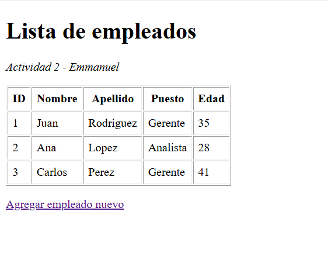
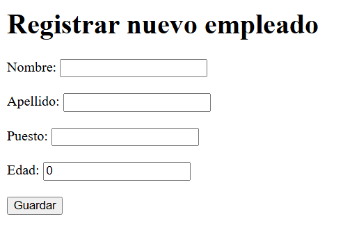
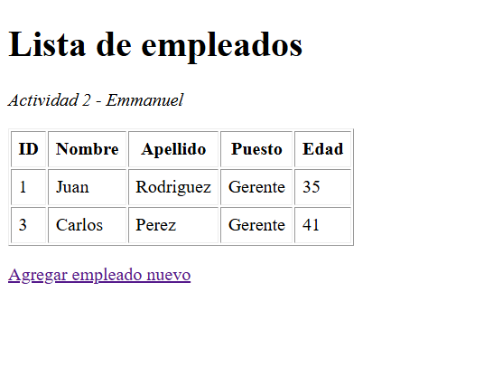
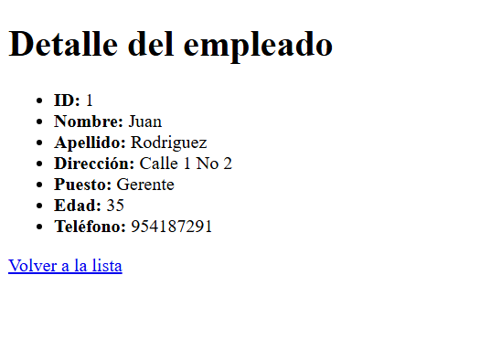
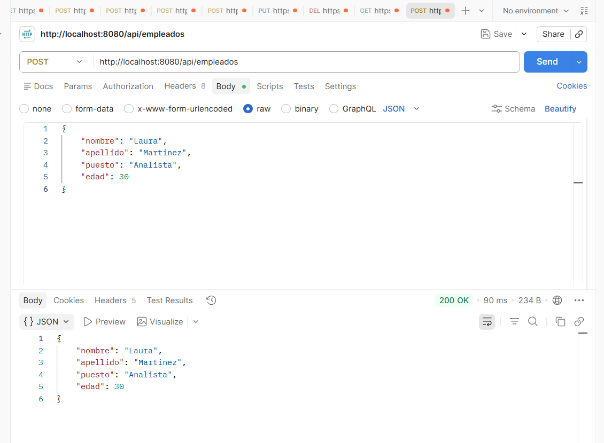

# Actividad 2 - Spring Boot MVC con Thymeleaf

Proyecto que construye sobre la Actividad 1, agregando el patrón MVC con vistas Thymeleaf, 
clases DTO, manejo de parámetros (@RequestParam, @PathVariable, @ModelAttribute), 
lectura de propiedades externas con @Value, y un endpoint POST probado con Postman.

## Endpoints

 `/empleados` - Lista de empleados (th:each)
 `/empleados/nuevo` - Formulario para nuevo empleado (@ModelAttribute)
 `/empleados/buscar?puesto=Gerente` - Búsqueda por puesto (@RequestParam)
 `/empleados/{id}` - Detalle de un empleado por id (@PathVariable)
 `POST /api/empleados` - Recibe un empleado en JSON usando el DTO (probado en Postman)

## Despliegue

 Proyecto corriendo en el VPS en el puerto 8084, sin afectar la instancia de la Actividad 1 (puerto 8082).

## Capturas de pantalla

### Lista de empleados (th:each)
Aquí va una captura de la vista `/empleados`, mostrando el listado recorrido con la directiva th:each.

### Formulario nuevo empleado (@ModelAttribute)
Aquí va una captura del formulario en `/empleados/nuevo`, y otra mostrando el resultado después de enviarlo, procesado con @ModelAttribute.

### Búsqueda por puesto (@RequestParam)
Aquí va una captura del endpoint `/empleados/buscar?puesto=Gerente`, filtrando la lista por el parámetro recibido.

### Detalle por id (@PathVariable)
Aquí va una captura del endpoint `/empleados/1`, mostrando el detalle del empleado obtenido a partir del id en la ruta.

### Petición POST en Postman
Aquí va una captura de Postman mostrando la petición POST a `/api/empleados`, con el body enviado y la respuesta JSON recibida.

